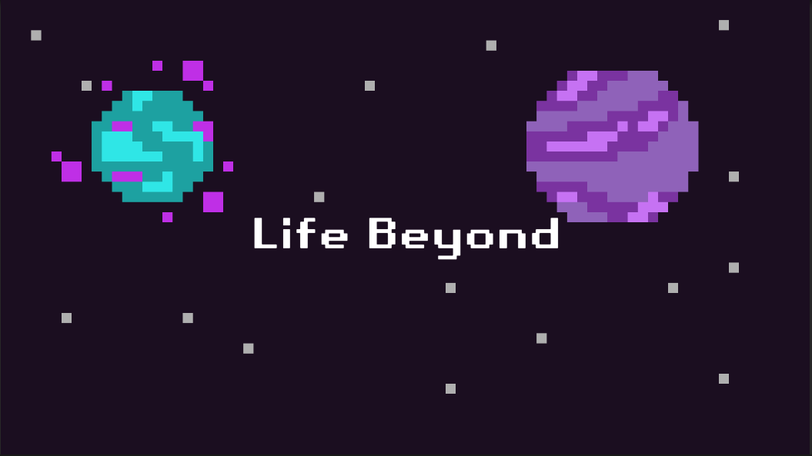

# Life Beyond

*2D platformer игра напрвена на Unity*

## Как да си сваля и използвам проекта?

### Инструкции за сваляне и инсталация

1) Отидете на https://nickgamingbruh.itch.io/life-beyond
2) Следвайте инструкциите, написани там

## Използвани технологии

* Unity 2D(https://unity.com) - *Unity е game engine поддържащ 2D и 3D графика. Езикът, който този engine използва е C#.*

## Информация за авторите на проекта

* **Никола Кръстанов** - *програмист* - NickProgrammerGaming(https://github.com/NickProgrammerGaming)
* **Александър Мечкаров** - *дизайнер* - Mechkarov-intel(https://github.com/Mechkarov-intel)
* **Злати Златев** - *мап дизайн* - Mechkarov-intel(https://github.com/Mechkarov-intel)
* **Александър Мечкаров** - *мап дизайн* - Mechkarov-intel(https://github.com/Mechkarov-intel)
